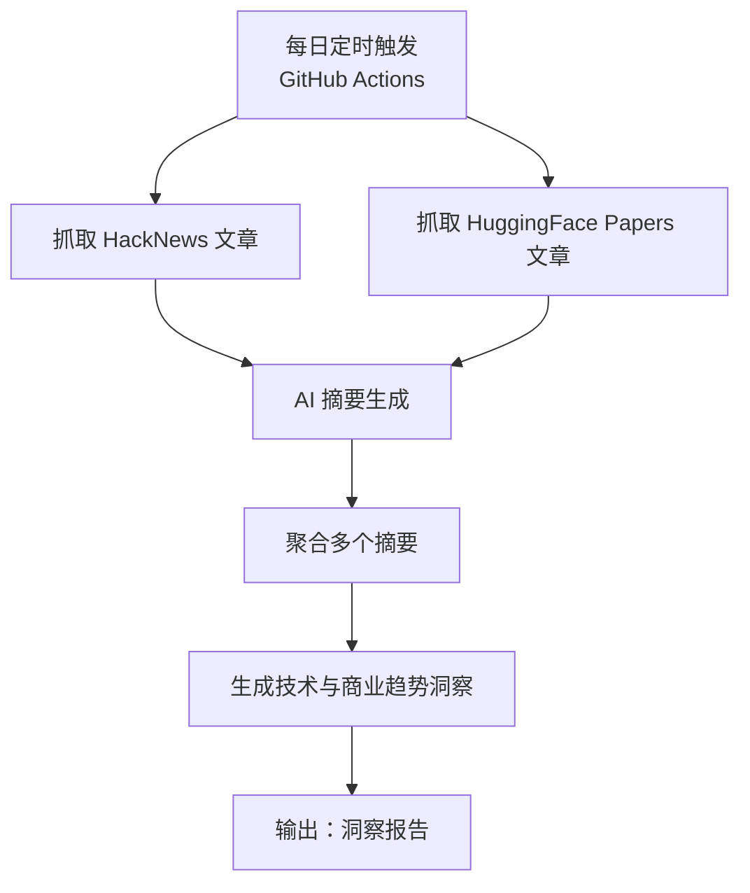

# ActionSchedule

Github Actions的调度任务，目前实现每日定时抓取 HackNews 与 HuggingFace Papers 的文章内容，进行AI摘要，最终基于多个摘要生成技术与商业趋势洞察与风向

```mermaid
graph TD
    A[每日定时触发<br>GitHub Actions] --> B[抓取 HackNews 文章]
    A --> C[抓取 HuggingFace Papers 文章]
    B --> D[AI 摘要生成]
    C --> D
    D --> E[聚合多个摘要]
    E --> F[生成技术与商业趋势洞察]
    F --> G[输出：洞察报告]
```
