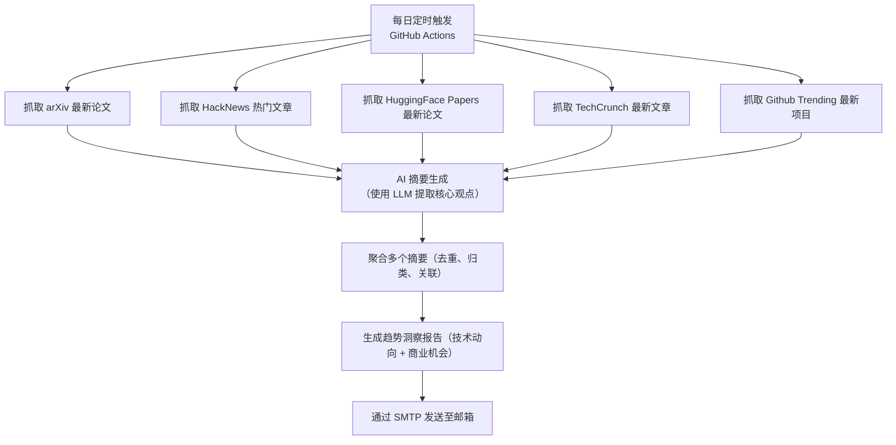

# ActionSchedule

一个基于 GitHub Actions 的自动化趋势洞察系统，每日定时抓取 arXiv、HackNews、 HuggingFace Papers、TechCrunch、GithubTrending 的最新文章，通过 AI 摘要与多源聚合，生成面向技术开发者与商业决策者的深度趋势洞察报告，并自动推送至邮箱

> 📬 从此，每天清晨，AI 为您阅读世界，提炼趋势

## 工作流程

## 使用说明
1. Fork 本项目
2. 配置环境变量，使用Actions secrets
环境变量说明：
- `GPT_API_KEY`：OpenAI API 密钥
- `GPT_API_URL`：OpenAI API URL
- `GPT_MODEL`：使用的 大语言模型
- `SMTP_USERNAME`：SMTP 用户名（现在支持 QQ 邮箱的账号）
- `SMTP_PASSWORD`：SMTP 密码（QQ 邮箱授权码）
- `EMAIL_RECIPIENT`：接收邮件的邮箱地址
- `FETCH_LIMIT`：每个数据源的抓取数量，默认 `5`
- `SUBSCRIPTION_SOURCES`：订阅的数据源，可选值`arxiv,hacker_news,huggingface_papers,tech_crunch,github_trending`，使用 `,` 分隔
3. 启用 GitHub Actions

## 📝 贡献指南

欢迎提交 Issue 和 Pull Request 来改进本项目！

## 📄 许可证

本项目采用 Apache-2.0 许可证，详情请见 [LICENSE](./LICENSE-APACHE) 文件。
