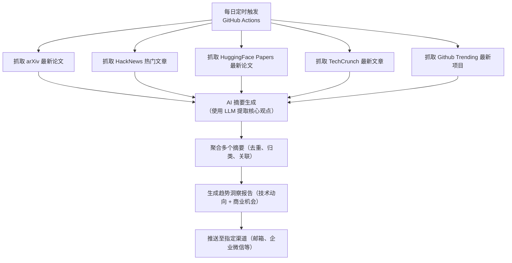

# ActionSchedule

一个基于 GitHub Actions 的自动化趋势洞察系统，每日定时抓取 arXiv、HackNews、 HuggingFace Papers、TechCrunch、GithubTrending 的最新文章，通过 AI 摘要与多源聚合，生成面向技术开发者与商业决策者的深度趋势洞察报告，并自动推送至邮箱、企业微信等指定渠道

> 📬 从此，每天清晨，AI 为您阅读世界，提炼趋势

## 工作流程



## 使用说明
### 1. Fork 本项目
### 2. 配置环境变量
使用Actions secrets，添加配置内容，环境变量名 `CONFIG`，环境变量值为yaml 格式，包含以下配置项：
```yaml
# OpenAI API 配置
model:
  name: gpt-3.5-turbo
  api_key: sk-xxxx
  api_url: https://api.openai.com/v1/chat/completions
  call_interval: 1 # 每次调用后的休眠时间，单位秒，默认值为 1 秒，避免对 API 速率限制

# SMTP 配置
smtp:
  server: smtp.qq.com
  sender: x@qq.com
  password: xxxxxxxx
  receiver: y@qq.com

# 企业微信机器人配置
wechat:
  webhook_url: https://qyapi.weixin.qq.com/cgi-bin/webhook/send?key=xxxxxx

# 推送配置
push:
  endpoint:
    - email
    - wechat

# 数据源配置
source:
  fetch_limit: 5
  subscription_sources:
    - arxiv
    - hacker_news
    - huggingface_papers
    - tech_crunch
    - github_trending
```

### 3. 启用 GitHub Actions

## 📝 贡献指南

欢迎提交 Issue 和 Pull Request 来改进本项目！

## 📄 许可证

本项目采用 Apache-2.0 许可证，详情请见 [LICENSE](./LICENSE-APACHE) 文件。
