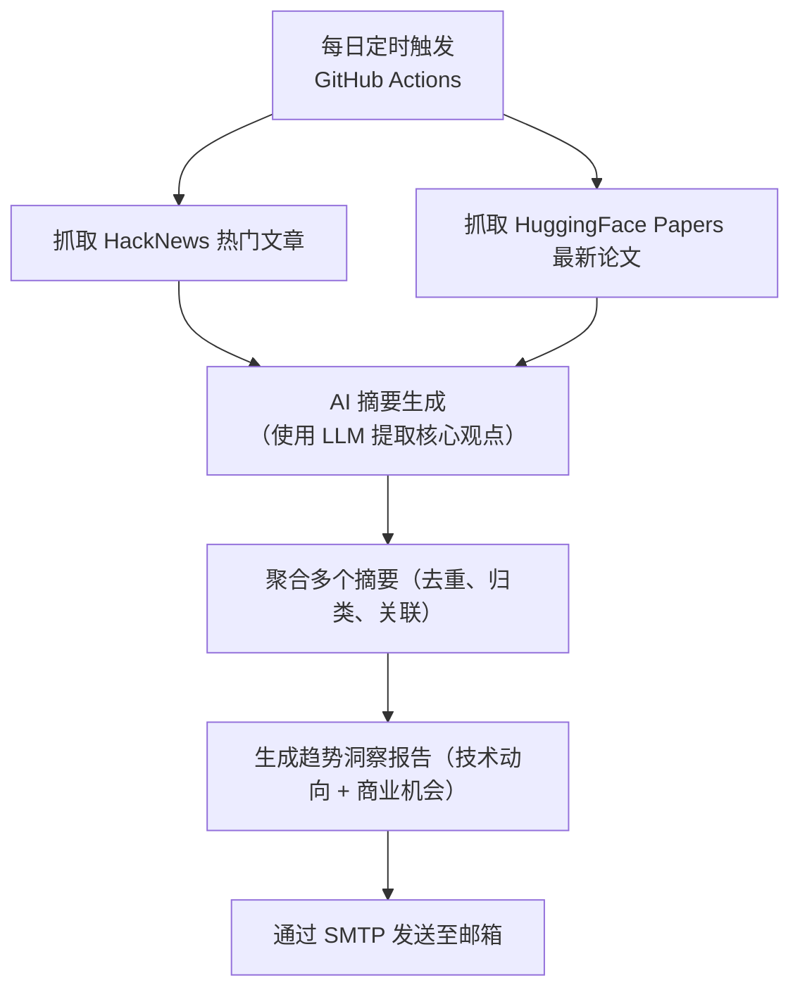

# ActionSchedule

一个基于 GitHub Actions 的自动化趋势洞察系统，每日定时抓取 HackNews 与 HuggingFace Papers 的最新文章，通过 AI 摘要与多源聚合，生成面向技术开发者与商业决策者的深度趋势洞察报告，并自动推送至邮箱

## 工作流程

```mermaid
graph TD
    A[每日定时触发<br>GitHub Actions] --> B[抓取 HackNews 热门文章]
    A --> C[抓取 HuggingFace Papers 最新论文]
    B --> D[AI 摘要生成<br>（使用 LLM 提取核心观点）]
    C --> D
    D --> E[聚合多个摘要（去重、归类、关联）]
    E --> F[生成趋势洞察报告（技术动向 + 商业机会）]
    F --> G[通过 SMTP 发送至邮箱]
```

> 📬 从此，每天清晨，AI 为您阅读世界，提炼趋势
